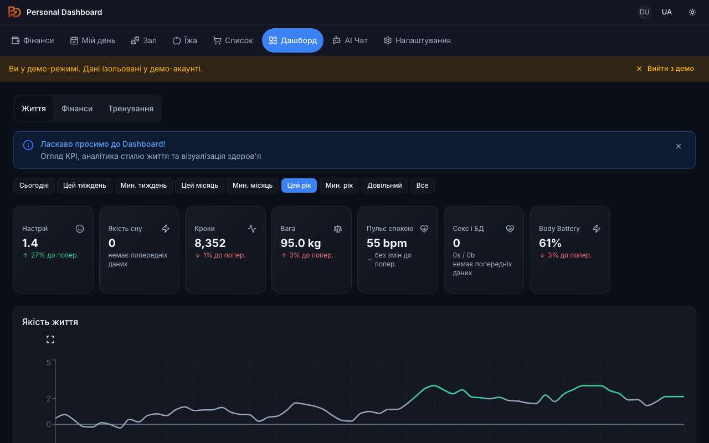

# Personal Dashboard

**Your life, your data, your server.**

Open-source, self-hosted personal dashboard for finance, health, fitness, investments, trading, and tax reporting. Built with Next.js 16, React 19, Prisma, and Tailwind CSS.

[](LICENSE)



> **[See all features with screenshots →](https://pd.taras.cloud/about)**

## Quick Start

### One-click Setup (recommended)

```bash
# 1. Clone the repo
git clone https://github.com/tpedchenko/personal-dashboard.git
cd personal-dashboard

# 2. Build and run the Setup Wizard
cd setup
docker build -t pd-setup .
docker run -p 3000:3000 -v $(pwd)/../:/output pd-setup
```

Open [http://localhost:3000](http://localhost:3000) — the Setup Wizard will guide you through 6 steps:

1. **Choose language** — English, Українська, Español
2. **Select modules** — Finance, Health, Gym, AI Chat, and more
3. **Configure integrations** — Garmin, bank sync, AI providers (enter API keys in the web form)
4. **Set up auth** — Google OAuth or Demo Mode
5. **Seed demo data** — optional, fills the app with sample data for quick start
6. **Deploy** — generates `.env` and `docker-compose.yml`, then run:

```bash
# 3. After the wizard finishes, start the dashboard
cd ..
docker compose up -d
```

Open [http://localhost:3000](http://localhost:3000) — your Personal Dashboard is ready!

> **No manual `.env` editing required** — the wizard generates everything from the web form.
> Secrets (NEXTAUTH_SECRET, ENCRYPTION_KEY) are auto-generated.

### Manual Setup (for advanced users)

```bash
git clone https://github.com/tpedchenko/personal-dashboard.git
cd personal-dashboard
cp next/.env.example .env
# Edit .env
docker compose up -d
```

Open [http://localhost:3000](http://localhost:3000). The first sign-in becomes the owner.

### Local Development

```bash
cd next
npm install
cp .env.example .env
# Edit .env

npx prisma migrate deploy
npx prisma generate
npm run dev
```

See [CONTRIBUTING.md](CONTRIBUTING.md) for the full development guide.

## Features

- **Finance** — Transaction tracking with Monobank & bunq sync, monthly budgets, multi-currency (EUR/UAH/USD), category breakdown, recurring payments
- **Investments** — Portfolio tracking across IBKR, Trading 212, and eToro. NAV history, P&L, asset allocation
- **Health** — Garmin Connect sync (sleep, HRV, Body Battery, stress, VO2max) and Withings (weight, body fat)
- **Gym & Workouts** — 100+ exercise library, custom programs, set/rep/weight tracking, PR detection, muscle recovery heatmap
- **AI Assistant** — Chat with your data using Gemini, Groq, or local Ollama models. RAG context across all modules
- **My Day** — Daily mood, energy, stress tracking with journal entries
- **Food Tracking** — Calorie and protein tracking with daily targets and 30-day trend charts
- **Shopping List** — Shared lists with purchase history and AI-powered spending insights
- **Trading** — Freqtrade bot integration with real-time control, P&L charts, and per-pair analysis
- **Tax Reporting** — Ukrainian FOP (DPS API) and Spanish IRPF (Modelo 100 simulator, broker report parsers)
- **Dashboard** — Unified KPIs, lifestyle correlations (sleep vs mood vs exercise vs spending)
- **PWA** — Installable on mobile via Serwist service worker
- **Multi-language** — English, Ukrainian, Spanish (next-intl)
- **Multi-user** — Google OAuth with owner/guest roles and invite system

## Integrations

Garmin Connect, Monobank, bunq, Interactive Brokers, Trading 212, eToro, Freqtrade, Withings, Telegram Bot, Kraken, Binance, Cobee, DPS (UA Tax)

## Tech Stack

| Layer | Technologies |
|-------|-------------|
| **Frontend** | Next.js 16, React 19, TypeScript 5, Tailwind CSS 4, shadcn/ui, Recharts, cmdk |
| **Backend** | Next.js App Router, Server Actions, Prisma 7, NextAuth 5 (beta) |
| **Database** | PostgreSQL 17, Redis 7, PgBouncer |
| **AI** | Vercel AI SDK, Gemini 2.5 Flash, Groq, Ollama (local), pgvector embeddings |
| **Infra** | Docker (multi-stage), Node 22-alpine, Serwist (PWA) |
| **Testing** | Playwright (E2E), Vitest (unit) |

## About

Visit the [/about](https://pd.taras.cloud/about) page for a full visual overview of all modules with screenshots.

## License

This project is licensed under the [GNU Affero General Public License v3.0](LICENSE).

If you use this software to provide a service over a network, you must make the source code available to users of that service.

## Contributing

Contributions are welcome! Please read [CONTRIBUTING.md](CONTRIBUTING.md) before submitting a pull request.
